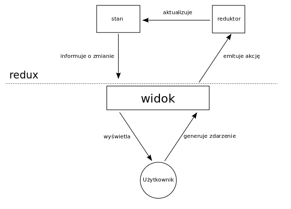

================================
React i Redux - budowa prostej aplikacji krok po kroku.
================================

..
`Redux <http://rackt.org/redux/index.html>`_ jest kontenerem stanów dla aplikacji JavaScritp. Ułatwia pisanie aplikacji które zachowują się konsekwentnie w różnych środowiskach (klient, serwer) oraz są łatwe w testowaniu. W tym wpisie użyjemy go do stworzenia prostej aplikacji - listy przypomnień.

Aplikacja będzie:
    - umożliwiała dodawanie przypomnień składających się z daty i opisu,
    - sprawdzała poprawność wprowadzonej daty,
    - wymuszała minimalną długość opisu
    - umożliwiała oznaczanie zrealizowanych przypomnień,
    - implementowała funkcję "Cofnij ostatnią zmianę"

    Zrzut ekranu gotowej aplikacji.

Czego będziemy używać
----------------------
Do stworzenia aplikacji wykorzystamy: `Node\.js <http://nodejs.org>`_  w wersji 4.2.4 z menadżerem pakietów `npm <https://www.npmjs.com>`_, `Webpack <https://webpack.github.io>`_, `Babel <https://babeljs.io>`_, `Bootstrap <http://getbootstrap.com>`_, `React <https://facebook.github.io/react/>`_ i Redux. Będziemy korzystać z nowych elementów języka JavaScript zawartych w `ECMAScript 6 <https://babeljs.io/docs/learn-es2015/>`_. Użyjemy również biblioteki `immutable <https://facebook.github.io/immutable-js/>`_ do obsługi niezmiennych (immutables) kolekcji oraz `moment.js <http://momentjs.com>`_ do walidacji daty.

Stworzenie struktury projektu
-----------------------------
Na początek musimy zainstalować node.js oraz menadżer npm. Sposób instalacji zależy od systemu operacyjnego i nie będziemy go tu opisywać. Następnie tworzymy folder na projekt, inicjujemy nowy projekt npm i tworzymy wewnętrzną strukturę projektu.

.. code-block:: bash

    mkdir todo
    cd todo
    npm init -y
    mkdir dist
    mkdir src

Kolejnym krokiem jest instalacja i konfiguracja webpacka. W tym celu przy użyciu npm instalujemy pakiety webpack i webpack-dev-server.

.. code-block:: bash

    npm install --save-dev webpack webpack-dev-server

Tworzymy plik dist/index.html w którym będzie osadzona nasza aplikacja.

.. code-block:: HTML
    :caption: dist/index.html

    <!DOCTYPE html>
    <html>
    <body>
        

        
    </body>
    </html>

Cały kod źródłowy będzie znajdować się w pliku bundle.js, który znajduje się w tym samy katalogu. Plik ten będzie generowany przez webpack na podstawie konfiguracji z pliku webpack.config.js.

.. code-block:: JavaScript
    :caption: webpack.config.js

    var webpack = require('webpack');

    module.exports = {
      entry: [
        './src/index.jsx'
      ],
      output: {
        path: __dirname + '/dist',
        publicPath: '/',
        filename: 'bundle.js'
      },
      devServer: {
        contentBase: './dist'
      }
    };

Konfiguracja zawiera również informację o tym że plikiem wejściowym (entry point) aplikacji jest plik src/index.jsx oraz że katalogiem głównym dla webpack-dev-server jest folder dist. Ponieważ w pliku index będziemy używać składni `jsx <https://facebook.github.io/react/docs/jsx-in-depth.html>`_ nadajemy mu rozszerzenie jsx zamiast js. Stwórzmy więc plik src/index.jsx

.. code-block:: JavaScript
    :caption: src/index.jsx

    alert('OK')

i przetestujmy naszą aplikację uruchamiając polecenie

.. code-block:: bash

    node_modules/webpack-dev-server/bin/webpack-dev-server.js --port 8080

a następnie otwierając w przeglądarce adres http://localhost:8080/. Żeby ułatwić sobie życie dodajmy do pliku package.json polecenie start uruchamiające serwer webpacka.

.. code-block:: JavaScript
    :caption: package.json

    "scripts": {
        "start": "node_modules/webpack-dev-server/bin/webpack-dev-server.js --port 8080"
    }

Teraz naszą aplikację możemy uruchomić poleceniem

.. code-block:: bash

    npm start

Następnie zainstalujmy i skonfigurujmy bibliotekę babel dzięki której będziemy mogli korzystać z ECMAScript 6 i składni jsx. W tym celu wykonujemy polecenie:

.. code-block:: bash

    npm install --save-dev babel-core babel-loader babel-preset-es2015 babel-preset-react

konfigurujemy z jakich rozszerzeń składni chcemy korzystać:

.. code-block:: JavaScript
    :caption: package.json

    "babel": {
        "presets": ["es2015", "react"]
    }

oraz informujemy webpack że wszystkie pliki (oprócz tych w folderze node_modules) js i jsx mają być przetwarzane przez babel

.. code-block:: JavaScript
    :caption: webpack.config.js

    module: {
        loaders: [{
        test: /\.jsx?$/,
        exclude: /node_modules/,
        loader: 'babel'
        }]
    },
    resolve: {
        extensions: ['', '.js', '.jsx']
    }

Kolejną biblioteką której będziemy potrzebować jest bootstrap. Instalujemy go poleceniem

.. code-block:: bash

    npm install --save bootstrap

dodajemy niezbędną konfigurację webpacka

.. code-block:: JavaScript
    :caption: webpack.config.js

    module: {
        loaders: [{
          test: /\.jsx?$/,
          exclude: /node_modules/,
          loader: 'babel'
        },
        {
          test: /\.css$/,
          loader: 'style!css'
        },
        {
          test: /\.eot(\?v=\d+\.\d+\.\d+)?$/,
          loader: "file"
        },
        {
          test: /\.(woff|woff2)$/,
          loader:"url?prefix=font/&limit=5000"
        },
        {
          test: /\.ttf(\?v=\d+\.\d+\.\d+)?$/,
          loader: "url?limit=10000&mimetype=application/octet-stream"
        },
        {
          test: /\.svg(\?v=\d+\.\d+\.\d+)?$/,
          loader: "url?limit=10000&mimetype=image/svg+xml"
        }
        ]
    }

instalujemy dodatkowe loadery dla webpacka

.. code-block:: bash

    npm install --save-dev style-loader css-loader file-loader url-loader

i importujemy bootstrap.css w pliku index.jsx

.. code-block:: JavaScript
    :caption: src/index.jsx

    import 'bootstrap/dist/css/bootstrap.css';

Ostatnim krokiem jest instalacja pozostałych zależności.

.. code-block:: bash

    npm install --save immutable moment react react-dom react-redux redux

Stworzenie komponentów react
-----------------------------

Teraz kiedy mamy już skonfigurowany projekt możemy zacząć pisać naszą aplikację. Zaczniemy od stworzenia interfejsu użytkownika i podzieleniu go na komponenty reacta wyświetlające statyczne dane  bez żadnej interakcji. Na początek stwórzmy plik src/components.jsx w którym będzie umieszczać nasze komponenty. Zaczniemy od jednego komponenty który będzie zawierał cała aplikację jako statyczny kod HTML.

.. code-block:: HTML
    :caption: src/components.jsx

    import React from 'react';

    export const App = React.createClass({
        render: function () {
            return 

                

                    <h3>Przypomnienia</h3>
                    

                        <a href="#" className="list-group-item list-group-item-success">
                             12.12.2015 Dapibus ac facilisis in
                            
                        </a>
                        <a href="#" className="list-group-item">
                             02.02.2016 Morbi leo risus
                        </a>
                    

                    <button type="submit" className="btn btn-warning">Cofnij ostatnią akcję</button>
                

                

                    <h3>Nowe przypomnienie</h3>
                    <form>
                        

                            <input className="form-control" name="name" placeholder="Data" />
                        

                        

                            <input className="form-control" name="name" placeholder="Opis" />
                        

                        <button type="submit" className="btn btn-default pull-right">Dodaj</button>
                    </form>
                

            

        }
    })

Żeby wyświetlić komponent musimy użyć funkcji render z ReactDOM

.. code-block:: JavaScript
    :caption: src/index.jsx

    import 'bootstrap/dist/css/bootstrap.css';
    import React from 'react';
    import ReactDOM from 'react-dom';
    import {App} from './components'

    ReactDOM.render(
        <App />,
        document.getElementById('app')
    );

Teraz podzielimy naszą aplikację na mniejsze elementy na początek wydzielimy dwa komponenty listę przypomnień "TodosList" i formularz dodawania "AddTodo".

.. code-block:: HTML
    :caption: src/components.jsx

    const TodosList = React.createClass({
        render: function () {
            return 

                <h3>Przypomnienia</h3>
                

                    <a href="#" className="list-group-item list-group-item-success">
                             12.12.2015 Dapibus ac facilisis in
                            
                        </a>
                        <a href="#" className="list-group-item">
                             02.02.2016 Morbi leo risus
                        </a>
                

                <button type="submit" className="btn btn-warning">Cofnij ostatnią akcję</elementy>
            

        }
    })

    con "AddTodo" = "Ret".createClass({
        render: function () {
            return 

                <h3>Nowe przypomnienie</h3>
                <form>
                    

                        <input className="form-control" name="name" placeholder="Data" />
                    

                    

                        <input className="form-control" name="name" placeholder="Opis" />
                    

                    <button type="submit" className="btn btn-default pull-right">Dodaj</button>
                </form>
            

        }
    })

    export const App = React.createClass({
        render: function () {
            return 

                <TodosList />
                <AddTodo />
            

        }
    })

W kolejnym kroku wydzielimy jeszcze dwa komponenty: przycisk "Cofnij ostatnią akcję" (UndoButton) i pojedyncze przypomnienie (TodoItem).

.. code-block:: JavaScript
    :caption: src/components.jsx

    const UndoButton = React.createClass({
        render: function () {
            return <button type="submit" className="btn btn-warning">Cofnij ostatnią akcję</button>
        }
    })

    const TodoItem = React.createClass({
        render: function () {
            var classes = "list-group-item";
            if (this.props.done) {
                classes = classes + " list-group-item-success";
            }
            return <a href="#" className={ classes }>
                {this.props.date} {this.props.description}
                { this.props.done ?  : "" }
            </a>
        }
    })

Komponent TodoItem przyjmuje atrybuty: "id", "date", "description" i "done". Jeżeli ustawimy wartość atrybutowi "done" tag "a" będzie miał dodatkową klasę "list-group-item-success" i będzie zawierać tag "span" z ikoną oznaczającą realizację przypomnienia.

Teraz musimy zaktualizować TodosList tak aby wykorzystywał nowo stworzone komponenty.

.. code-block:: JavaScript
    :caption: src/components.jsx

    const TodosList = React.createClass({
    render: function () {
        return 

            <h3>Przypomnienia</h3>
            

                <TodoItem date="12.12.2015" description="Dapibus ac facilisis in" done="true" />
                <TodoItem date="02.02.2016" description="Morbi leo risus" />
            

            <UndoButton />
        

        }
    })

Zmodyfikujmy teraz TodosList tak aby dane o przypomnieniach były ustawiane poprzez atrybut "todos". Przypomnienia będziemy przekazywali w formie tablicy obiektów. Jednym z głównych założeń reduxa jest to że stan (state) jest tylko do odczytu. Dlatego zamiast korzystania z wbudowanych w JavaScript tablic i obiektów do przechowywania danych użyjemy bibliotekę immutable, która zamiast modyfikować obiekt zwraca nowy obiekt z nową zawartością.

.. code-block:: JavaScript
    :caption: src/components.jsx

    var todos = Immutable.fromJS([
        {id:"0", date:"12.12.2015", description:"Dapibus ac facilisis in", done:"true"},
        {id:"1", date:"02.02.2016", description:"Morbi leo risus"}
    ])

    const TodosList = React.createClass({
        render: function () {
            return 

                <h3>Przypomnienia</h3>
                

                    {this.props.todos.map(todo =>
                        <TodoItem key={todo.get('id')} id={todo.get('id')} date={todo.get('date')} description={todo.get('description')} done={todo.get('done')} />
                    )}
                

                <UndoButton />
            

        }
    })

Redux - stan, akcje i reduktory
--------------------

Redux opiera się na trzech założeniach:
    - cały stan aplikacji przechowywany jest w pojedynczym obiekcie (store),
    - stan jest tylko do odczytu a jedynym sposobem "zmiany" stanu jest wyemitowanie akcji,
    - wszystkie "zmiany" stanu są realizowane za pomocą funkcji redukujących które nie mają `skutków ubocznych <https://pl.wikipedia.org/wiki/Skutek_uboczny_(informatyka)>`_

**Akcja** jest obiektem reprezentującym zamiar zmiany stanu. Każda akcja musi posiadać typ, może też posiadać inne atrybuty potrzebne do zmiany stanu.

**Reduktor** (reducer) jest funkcją przyjmującą dwa parametry: obecny stan aplikacji oraz akcję i zwracającą nowy stan aplikacji. Przy czym nowy stan może (ale nie musi) różnić się od poprzedniego.
Pojęcia reduktor i funkcja redukująca są tożsame.

Poniżej znajduje się przykład bardzo prostej aplikacji napisanej z użyciem reduxa. Posiada ona dwa przyciski "+" i "-" zwiększające i zmniejszające licznik. Cały stan aplikacji stanowi wartość licznika.

.. code-block:: HTML

    

    
0

    <button onclick="inc()" >+</button>
    <button onclick="dec()" >-</button>

Algorytm działania aplikacji jest następujący:
 - użytkownik klika jeden z przycisków,
 - przycisk reaguje na zdarzenie wciśnięcia wywołaniem funkcji "inc" lub "dec", która emituje akcję za pomocą "store.dispatch",
 - wyemitowana akcja trafia do reduktora, który zwraca nowy stan aplikacji - licznik zwiększony lub zmniejszony o jeden,
 - store informuje funkcje nasłuchujące (dodane za pomocą "store.subscribe") o zmianie stanu,
 - wywoływana jest funkcja "refresh", która aktualizuje wartość licznika w przeglądarce

    Schemat działania aplikacji redux.

W naszej aplikacji rolę widoku będzie pełnić react.

Stan
^^^^
Stan aplikacji składał się będzie z trzech elementów: listy przypomnień, danych formularza i poprzedniego stanu aplikacji potrzebnego do działania UndoButton. Obiekt "todo" będzie zawierał: id, datę, opis i flagę czy został oznaczony jako zrealizowany. Dane formula będą zawierać wartość wprowadzoną przez użytkownika i treść ewentualnego błędu walidacji dla daty i opisu.

Stwórzmy nowy plik "src/reducers.js" i umieśćmy w nim początkowy (pusty) stan naszej aplikacji oraz potrzebne importy.

.. code-block:: JavaScript
    :caption: src/reducers.js

    import * as Immutable from 'immutable';
    import moment from 'moment';

    const emptyState = Immutable.fromJS({
        todos: [],
        addForm: {
            date: {
                value: '',
                error: null
            },
            description: {
                value: '',
                error: null
            }
        },
        lastState: null
    })

Reduktory i akcje
^^^^^^^^^^^^^^^^^
Stwórzmy teraz funkcje redukujące za pomocą których będziemy mogli "modyfikować" stan naszej aplikacji.

.. Dla uproszczenia w dalszej części wpisu będziemy nazywać je reduktorami.

Zacznijmy od funkcji "saveState" będzie ona zapisywać aktualny stan aplikacji do atrybutu "lastState"

.. code-block:: JavaScript
    :caption: src/reducers.js

    function saveState (state) {
        return state.update('lastState', () => state);
    }

dzięki temu będziemy mogli zrealizować funkcjonalność "undo".

Kolejną funkcją będzie "setState" która umożliwi ustawianie stanu aplikacji.

.. code-block:: JavaScript
    :caption: src/reducers.js

    function setState (state, newState) {
        return state.merge(newState);
    }

Następnie dodamy "undo".

.. code-block:: JavaScript
    :caption: src/reducers.js

    function undo (state) {
        var lastState = state.get('lastState');
        if (lastState) {
            return setState(state, lastState);
        } else {
            return state
        }
    }

Przejdźmy teraz do obsługi dodawania nowego przypomnienia. Na początek będziemy potrzebowali funkcji które będą sprawdzały poprawność danych. Funkcja "validateDescription" sprawdzi czy opis jest poprawny (minimum trzy znaki) jeżeli tak zwróci "null" jeżeli nie zwróci komunikat o błędzie.

.. code-block:: JavaScript
    :caption: src/reducers.js

    function validateDescription (description) {
        var err = null;
        if (description.length < 3) {
            err = 'Opis musi mieć minimum 3 znaki';
        }
        return err;
    }

W analogiczny sposób będzie działać funkcja "validateDate"

.. code-block:: JavaScript
    :caption: src/reducers.js

    function validateDate (date) {
        var err = null;
        if (!moment(date, 'DD.MM.YYYY', true).isValid()) {
            err = 'Data '+ date + ' nie jest poprawną datą w formacie dd.mm.rrrr'
        }
        return err;
    }

Teraz możemy zaimplementować reduktory obsługujące zmianę pól tekstowych. Do aktualizacji stanu użyjemy metody "updateIn". Jej pierwszym parametrem jest lista z hierarchią węzłów stanu aplikacji. Drugim parametrem jest funkcja która przyjmuje ostatni węzeł z hierarchii. Wartość zwrócona przez tę funkcje staje się nową wartością przekazanego węzła.

.. code-block:: JavaScript
    :caption: src/reducers.js

    function dateChange (state, date) {
        var error = validateDate(date);
        state = state.updateIn(['addForm', 'date', 'error'], value => error);
        state = state.updateIn(['addForm', 'date', 'value'], value => date);
        return state;
    }

    function descriptionChange (state, description) {
        var error = validateDescription(description);
        state = state.updateIn(['addForm', 'description', 'error'], value => error);
        state = state.updateIn(['addForm', 'description', 'value'], value => description);
        return state;
    }

Skoro mamy już funkcje obsługujące pola formularza możemy stworzyć reduktor "addTodo" dodającą nowe przypomnienie. Do pobrania daty i opisu użyjemy funkcji "getIn", która przyjmuje listę z hierarchią węzłów stanu aplikacji.

.. code-block:: JavaScript
    :caption: src/reducers.js

    var lastTodoId = 100;
    function addTodo (state) {
        var date = state.getIn(['addForm', 'date', 'value']);
        var description = state.getIn(['addForm', 'description', 'value']);
        var dateError = validateDate(date);
        var descriptionError = validateDescription(description);
        state = state.updateIn(['addForm', 'date', 'error'], value => dateError);
        state = state.updateIn(['addForm', 'description', 'error'], value => descriptionError);
        if ( !dateError && !descriptionError ) {
            let todo = Immutable.Map({ id: lastTodoId, date: date, description: description });
            state = state.updateIn(['todos'], todos => todos.push(todo));
            lastTodoId++;
        }
        return state;
    }

Ostatnią funkcją jakiej potrzebujemy jest "switchDone" która obsłuży zmianę statusu "done".

.. code-block:: JavaScript
    :caption: src/reducers.js

    function switchDone (state, todoId) {
        var index = state.get("todos").findIndex( todo => todo.get('id') == todoId);
        if (index != -1) {
            return state.updateIn(['todos', index], todo => todo.update('done', done => !done ));
        } else {
            return state;
        }
    }

Zaimplementowaliśmy już wszystkie funkcje redukujące więc możemy napisać nasz główny reduktor

.. code-block:: JavaScript
    :caption: src/reducers.js

    export default function (state = emptyState, action) {
        switch (action.type) {
        case 'SET_STATE':
            return setState(state, action.newState);
        case 'SWITCH_DONE':
            return switchDone(saveState(state), action.todoId);
        case 'ADD_TODO':
            return addTodo(saveState(state));
        case 'UNDO':
            return undo(state);
        case 'DATE_CHANGE':
            return dateChange(state, action.date);
        case 'DESCRIPTION_CHANGE':
            return descriptionChange(state, action.description);
        }
        return state;
    }

Funkcje tworzące akcje
^^^^^^^^^^^^^^^^^^^^^^

Kolejnym elementem potrzebnym do działania aplikacji są funkcje tworzące akcje (action creators). Są to jak wskazuje nazwa funkcje które zwracają obiekty akcji. Będziemy je później wykorzystywali do połączenia komponentów reacta z reduxem.

Stwórzmy więc plik "src/actions.js"

.. code-block:: JavaScript
    :caption: src/actions.js

    export function setState (newState) {
        return {
            type: 'SET_STATE',
            newState
        };
    }

    export function switchDone (todoId) {
        return {
            type: 'SWITCH_DONE',
            todoId
        };
    }

    export function addTodo () {
        return {
            type: 'ADD_TODO',
        };
    }

    export function undo () {
        return {
            type: 'UNDO',
        };
    }

    export function dateChange (date) {
        return {
            type: 'DATE_CHANGE',
            date
        };
    }

    export function descriptionChange (description) {
        return {
            type: 'DESCRIPTION_CHANGE',
            description
        };
    }

Połączenie reacta z reduxem
----------------------------

W tym momencie nasza aplikacja składa się z dwóch niepołączonych ze sobą części: stanu aplikacji wraz z akcjami które pozwalają nam go zmieniać i komponentów które wyświetlają statyczne dane. Kolejnym krokiem będzie więc połączenie tych dwóch elementów. Zaczniemy od stworzenia zasobu (store) na podstawie reduktora (reducer).

.. code-block:: JavaScript
    :caption: src/index.jsx

    import reducer from './reducers';
    import {createStore} from 'redux';

    const store = createStore(reducer);

Następnie użyjemy komponentu "Provider" z biblioteki "react-redux" aby umożliwić dostęp do storea wszystkim komponentom bez potrzeby jawnego przekazywania go jako atrybut.

.. code-block:: JavaScript
    :caption: src/index.jsx

    import {Provider} from 'react-redux';

    ReactDOM.render(
        <Provider store={store}>
            <App />
        </Provider>,
        document.getElementById('app')
    );

Zmodyfikujmy kontener "UndoButton"  tak aby w zależności od wartości atrybutu "lastState" przycisk miał odpowiednio ustawiony atrybut "disabled" oraz żeby po jego wciśnięciu wywoływana była funkcja przekazana poprzez atrybut "undo". "UndoButton" nie ma żadnej wiedzy o reduxie wszystkie potrzebne dane są mu przekazywane poprzez atrybuty.

.. code-block:: JavaScript
    :caption: src/components.jsx

    const UndoButton = React.createClass({
        render: function () {
            var disabled = this.props.lastState ? "" : "disabled";
            return <button type="submit" onClick={ () => this.props.undo() } disabled={disabled} className="btn btn-warning">Cofnij ostatnią akcję</button>
        }
    })

Teraz użyjemy funkcji "connect" z "react-redux" do stworzenia nowego komponentu "UndoButtonContainer" który opakowuje "UndoButton". Robimy to żeby oddzielić komponenty które są połączone z reduxem od tych które prezentują dane przekazane przez atrybuty.

.. code-block:: JavaScript
    :caption: src/components.jsx

    import {connect} from 'react-redux';
    import * as actionCreators from './actions'

    const UndoButtonContainer = connect(
        function (state) {
            return {
                lastState: state.get('lastState')
            }
        },
        {
            undo: actionCreators.undo
        }
    )(UndoButton);

Pierwszym parametrem  "connect" jest funkcja która przyjmuje stan aplikacji i zwraca atrybuty (w formie obiektu) które zostaną automatycznie przekazane do komponentu. Dzięki temu używając komponentu "UndoButtonContainer" nie będziemy musieli sami przekazywać atrybutu "lastState". Jako drugi parametr przekazujemy obiekt zawierający funkcje tworzące akcje (action creator). Dzięki temu nasz komponent "UndoButtonContainer" będzie zawierać atrybut "undo" którego wartością będzie funkcja odpowiadająca wywołaniu:

.. code-block:: JavaScript

    dispatch(undo())

Gdzie "undo" to funkcja tworząca akcję.

Dokładny opis i pozostałe parametry funkcji "connect" można znaleźć w `dokumentacji <https://github.com/rackt/react-redux/blob/master/docs/api.md#connectmapstatetoprops-mapdispatchtoprops-mergeprops-options>`_.

Zajmijmy się teraz kontenerem "AddTodo". Zacznijmy od dodana do niego obsługi zdarzeń "onChange" dla pól tekstowych oraz zdarzenia "submit" formularza. Dodamy także pod polami tekstowymi tag wyświetlający ewentualny błąd walidacji. Będziemy również ustawiać atrybut "disabled" przyciskowy "Dodaj" jeżeli są jakieś błędy walidacji.

.. code-block:: JavaScript
    :caption: src/components.jsx

    const AddTodo = React.createClass({
        dateChange: function (event) {
            this.props.dateChange(event.target.value);
        },
        descriptionChange: function (event) {
            this.props.descriptionChange(event.target.value);
        },
        submit: function (event) {
            event.preventDefault();
            this.props.addTodo();
        },
        render: function () {
            var disabledSubmit = this.props.descriptionError || this.props.dateError  ? "disabled" : "";
            return 

                <h3>Nowe przypomnienie</h3>
                <form onSubmit={this.submit} >
                    

                        <input className="form-control" value={this.props.dateValue} name="date" onChange={this.dateChange} placeholder="Data w formacie dd.mm.yyyy" />
                        { this.props.dateError ? <strong className="text-danger" >{this.props.dateError}</strong> : "" }
                    

                    

                        <input className="form-control" value={this.props.descriptionValue} onChange={this.descriptionChange} name="description" placeholder="Opis" />
                        { this.props.descriptionError ? <strong className="text-danger" >{this.props.descriptionError}</strong> : "" }
                    

                    <button type="submit" disabled={disabledSubmit} className="btn btn-default pull-right">Dodaj</button>
                </form>
            

        }
    })

Następne stworzymy komponent "AddTodoContainer" w analogiczny sposób jak poprzednio.

.. code-block:: JavaScript
    :caption: src/components.jsx

    const AddTodoContainer = connect(
      function (state) {
            return {
                dateValue: state.getIn(['addForm', 'date', 'value']),
                dateError: state.getIn(['addForm', 'date', 'error']),
                descriptionValue: state.getIn(['addForm', 'description', 'value']),
                descriptionError: state.getIn(['addForm', 'description', 'error']),
            }
      },
      actionCreators
    )(AddTodo);

Pozostało nam jeszcze stworzenie kontenera "TodosListContainer" i dodanie obsługi zdarzenia "onClick" w kontenerze "TodoItem"

.. code-block:: JavaScript
    :caption: src/components.jsx

    const TodoItem = React.createClass({
        switch: function() {
            this.props.switchDone((this.props.id));
        },
        render: function () {
            var classes = "list-group-item";
            if (this.props.done) {
                classes = classes + " list-group-item-success";
            }
            return <a href="#" className={ classes } onClick={this.switch}>
                {this.props.date} {this.props.description}
                { this.props.done ?  : "" }
            </a>
        }
    })

    const TodosList = React.createClass({
        render: function () {
            return 

                <h3>Przypomnienia</h3>
                

                    {this.props.todos.map(todo =>
                      <TodoItem key={todo.get('id')} id={todo.get('id')}
                       date={todo.get('date')} description={todo.get('description')}
                       done={todo.get('done')} switchDone={this.props.switchDone} />
                    )}
                

                <UndoButtonContainer />
            

        }
    })

    const TodosListContainer = connect(
      function (state) {
        return {
            todos: state.get('todos')
        }
      },
      actionCreators
    )(TodosList);

Ostatnim korokiem jest zmiana kontenera "App" tak żeby korzystał z "TodosListContainer" i "AddTodoContainer"

.. code-block:: JavaScript
    :caption: src/components.jsx

    export const App = React.createClass({
        render: function () {
            return 

                <TodosListContainer />
                <AddTodoContainer />
            

        }
    })

Kod powyższej aplikacji znajduje się na `githubie <https://github.com/wielbonnd/todo-redux>`_
